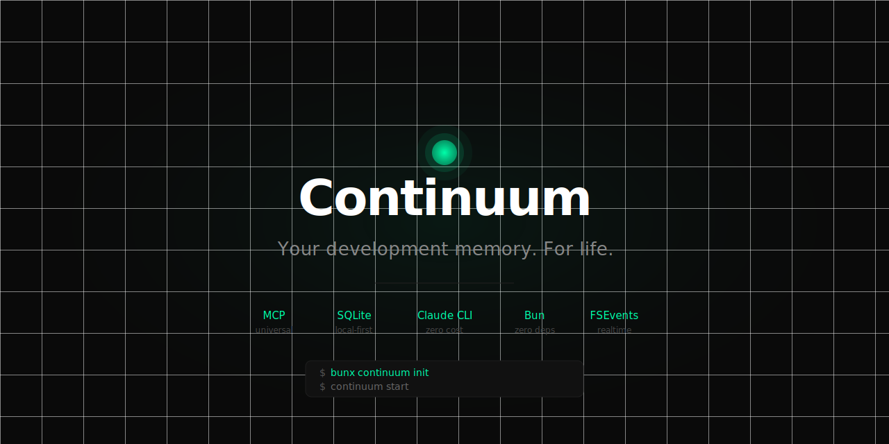

<p align="center">
  <picture>
    <source media="(prefers-color-scheme: dark)" srcset="assets/banner.svg"/>
    <source media="(prefers-color-scheme: light)" srcset="assets/banner-light.svg"/>
    
  </picture>
</p>

<p align="center">
  <a href="https://github.com/devjoaocastro/continuum/blob/main/LICENSE"></a>
  
  
  
  
</p>

---

# Continuum

**Your development memory. For life.**

You'll spend 10 years building software. Thousands of decisions. Hundreds of projects.

Why you chose Postgres over MongoDB. Why you rewrote the auth system. Why that one pattern works in this codebase and breaks in every other. The bug that took 3 days to find. The insight that changed how you think about the problem.

None of it is written down anywhere. Most of it is already gone.

**Continuum remembers.**

```bash
bunx continuum init
bunx continuum start
```

Every commit you make from now on is captured, understood, and kept — forever, locally, privately.

---

## What it captures

Continuum watches your git commits and extracts what actually matters:

- **Decisions** — *why* you made an architectural choice, not just what it was
- **Patterns** — conventions and approaches that work in this codebase
- **Context** — what you were working on, what problems you were solving

After a few weeks, `continuum snapshot myproject` synthesizes everything into a living document:

```markdown
# Your Project — Context

## Architecture
- Chose Hono over Express — Cloudflare Workers requires edge-compatible runtime
- D1 SQLite for persistence — no RETURNING clause, pattern: INSERT then SELECT

## Decisions that matter
- Replaced Docker with E2B Firecracker microVMs — 10x faster sandbox boot
  (Docker cold start was blocking UX at 4-6s, E2B gets to 400ms)
- Serial queue removed from streaming — Bun ReadableStream requires sync spawn in start()
  (spent 3h on this deadlock, the fix is non-obvious)

## Known gotchas
- D1 writes serialize through primary region — batch or you'll hit latency walls
- Worker bundle hard limit 10MB — audit dependencies before adding anything
```

A year from now, opening this project again — **everything is still there.**

---

## Works everywhere

Continuum exposes your memory via MCP — the universal protocol for AI tools.

| Tool | Status |
|------|--------|
| Claude Code | ✅ Auto-configured on `init` |
| Cursor | ✅ Auto-configured on `init` |
| Cline / RooCline | Manual (2 lines) |
| Continue.dev | Manual (2 lines) |
| Windsurf | Manual (2 lines) |
| Claude Desktop | Manual (2 lines) |
| Zed | Manual (2 lines) |
| Any tool with MCP | Manual (2 lines) |

Your memory travels with you. Switch tools, switch machines — the context follows.

---

## Quick start

**Requires:** [Bun](https://bun.sh) + [Claude Code CLI](https://claude.ai/download) (free, used for extraction)

```bash
# Setup: detects git projects, configures your AI tools
bunx continuum init

# Start: runs in background, watches your commits
bunx continuum start

# Work normally. Make commits. Continuum does the rest.

# After enough commits, generate your project's living document:
continuum snapshot myproject
```

---

## Commands

```bash
continuum init                     # Detect projects + configure Claude Code & Cursor
continuum start                    # Start daemon + MCP server
continuum snapshot [project]       # Generate living CONTINUUM.md from memories
continuum status                   # Show projects and memory counts
continuum add <project> <memory>   # Manually save something important
continuum sync init                # Setup GitHub sync (private repo)
continuum sync push                # Push memories to GitHub
continuum sync pull                # Pull memories from GitHub
```

---

## Cross-device sync

Your memories can travel between machines using a private GitHub repo as backend. No cloud service, no new accounts — just git.

```bash
# First time: creates a private repo and configures sync
continuum sync init

# Push your memories to GitHub
continuum sync push

# On another machine: pull memories from GitHub
continuum sync pull
```

**How it works:** Memories are exported as JSON files (one per project) into a private `<your-username>/continuum-memories` repo. The format is git-diffable, so you get full history of your memory evolution for free.

**Auto-sync:** Enable in `~/.continuum/config.json` to push automatically after every extraction:

```json
{
  "sync": {
    "enabled": true,
    "repo": "youruser/continuum-memories",
    "autoSync": true
  }
}
```

**Requirements:** [GitHub CLI](https://cli.github.com) (`gh`) installed and authenticated.

---

## Configuration

All settings live in `~/.continuum/config.json`:

```json
{
  "projects": [
    { "path": "/Users/you/projects/myapp", "name": "myapp" }
  ],
  "port": 3100,
  "model": "claude-haiku-4-5-20251001",
  "ignore": [".env", "*.pem", "*.key", "node_modules", ".git", "dist"],
  "sync": {
    "enabled": false,
    "repo": "",
    "autoSync": false
  }
}
```

| Setting | Default | Description |
|---------|---------|-------------|
| `projects` | `[]` | Git repos to watch (auto-detected on `init`) |
| `port` | `3100` | HTTP MCP server port |
| `model` | `claude-haiku-4-5-20251001` | Claude model for extraction |
| `ignore` | *(see above)* | File patterns to skip in diffs |
| `sync.enabled` | `false` | Enable GitHub sync |
| `sync.repo` | `""` | GitHub repo for sync (set by `sync init`) |
| `sync.autoSync` | `false` | Auto-push after every extraction |

---

## MCP setup (manual)

For any tool that supports MCP, add this to its config:

```json
{
  "mcpServers": {
    "continuum": {
      "command": "bunx",
      "args": ["continuum", "--mcp-only"]
    }
  }
}
```

Claude Code: `~/.claude.json` · Cursor: `~/.cursor/mcp.json` · Others: check their docs.

---

## How it works

```
You commit code
      ↓
Continuum reads the diff (secrets filtered out automatically)
      ↓
Claude CLI extracts decisions + patterns (uses your existing subscription)
      ↓
Stored in ~/.continuum/memories.db (local SQLite, never leaves your machine)
      ↓
MCP server exposes them to any AI tool you use
      ↓
continuum snapshot synthesizes everything into a CONTINUUM.md
      ↓
Claude Code / Cursor load it automatically on every session
```

Zero cloud. Zero new API keys. Zero new subscriptions.

---

## Security

- **Everything stays local** — `~/.continuum/` on your machine, nowhere else
- **Secrets are filtered** — diffs are scanned for API keys, tokens, and passwords before extraction. Matches are redacted.
- **Sensitive files skipped** — `.env`, `.pem`, `.key`, and similar files are never read
- **Extraction uses your Claude subscription** — not the API, not a new account
- **Open source** — read exactly what runs on your machine

---

## What it costs

Nothing. Extraction uses `claude -p` — the Claude CLI you already have. No new services, no new fees.

---

## The bigger picture

This started as an AI context tool. But the real thing it does is give you a **permanent, searchable record of your entire career as a developer.**

Every project. Every hard decision. Every pattern that works. Every bug you finally figured out.

In 5 years, you'll have a memory of everything you built. Not a portfolio — a *memory*. The reasoning, the tradeoffs, the moments that shaped how you think.

That's what Continuum is actually building.

---

## Contributing

The core works. Here's where it can go further:

- **[sqlite-vec](https://github.com/asg017/sqlite-vec)** — semantic search instead of TF-IDF
- **Windows support** — test `fs.watch` behavior, fix platform differences
- **More extraction backends** — Gemini CLI, Ollama, local models (no subscription required)
- **Team Mindspace** — share context between team members (requires a server)
- **Swift menu bar app** — native macOS UI for managing memories

---

## License

MIT

---

*Built in an afternoon. The kind of tool you wish had existed 5 years ago.*
